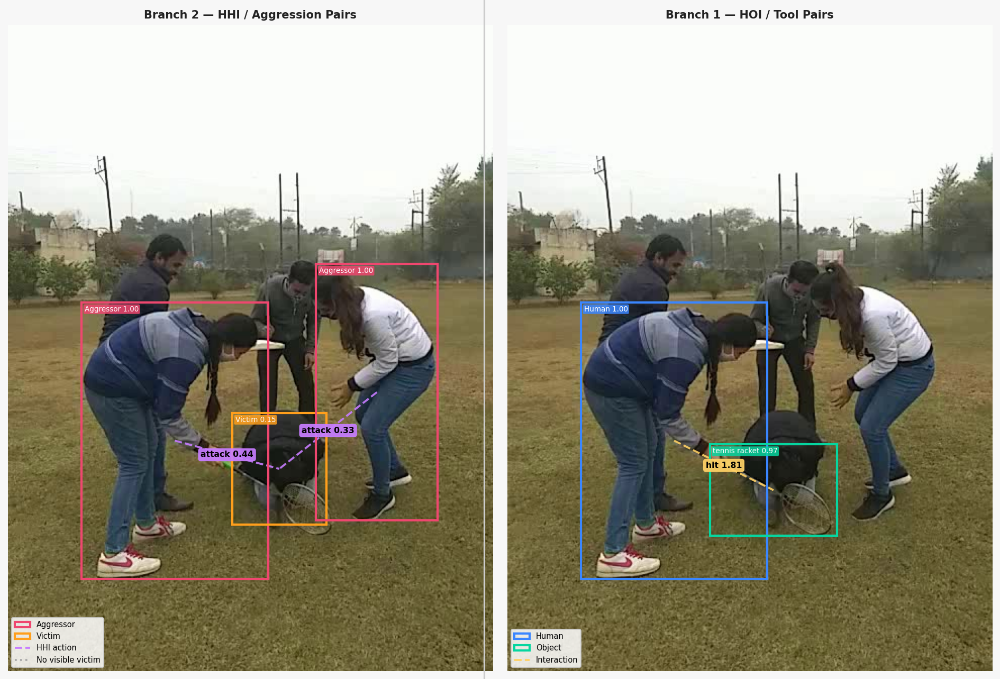

# CROSS-BRANCH INTERACTION FUSION WITH HUMAN-OBJECT TRANSFORMER (CBIF-HOTR) FOR VIOLENCE RECOGNITION

  

**Model Download Link**:https://drive.google.com/file/d/1q1HXf-jx5IbemV2CuQ7AApiSArN0X11u/view?usp=drive_link

Sample Output

  

